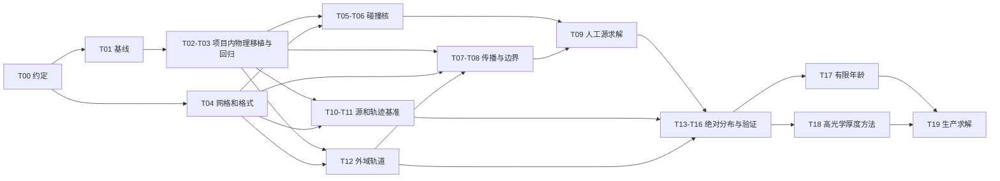

# SolarDM-Transport 开发任务计划

维护版本：2026-09-15。依据：[Proposal.md](Proposal.md)、DaMaSCUS-SUN-EVAP 只读固定提交及用户补充建议。具体源码定位见 [源码依据附录](Proposal.md#code-reference)；当前设计决策、局域核公式和后端契约见 [工程与性能设计附录](Proposal.md#performance-design)。

已进入初步实施，T00/T01 已完成，T02/T04/P00 正在推进，T03 及其余任务为 `pending`；当前状态集中于 §8。表中的物理验收数值仍是门槛，不是已取得的结果。

任务体系为 T00–T20、P00–P09，科学阶段为 G0–G6。G4 仍指有限年龄，不能被 CPU/GPU 里程碑替换。Proposal 已同步修正源码事实，原稿存于只读 [v1 存档](archive/Proposal_2026-09-14_v1.md)。

文档维护固定为 README、Proposal、Task_Plan、CHANGELOG 四份，规则见 [README](../README.md). 本文只维护任务、依赖、状态、验收与执行结论；科学/工程论证和源码证据统一引用 Proposal。后续不新增逐轮审阅、计划或备份文档。

## 1. 目标与交付边界

首个科学验收问题：**给定相同的首次捕获源，在相同太阳模型、散射物理与终止边界下，输运算符能否重现完整轨迹 MC 的绝对 occupation measure？**

第一版采用球对称、静态太阳背景和线性单粒子输运。保留完整 `(r,v,mu)`；太阳内部暂时 `E>=0` 的粒子仍属于活动状态，直到真正外行跨越逃逸面。第一版不包含 DM 自相互作用、湮灭反馈、探测器限制或全参数生产扫描。

| 阶段 | 交付结果 | 完成条件 |
| --- | --- | --- |
| G0：可信物理底座 | 固定基线、项目内移植物理模块、旧轨迹作为只读参照 | T00–T03 通过；来源、模型范围和随机数兼容性明确 |
| G1：局域碰撞原型 | 网格、可缓存碰撞生成元、热浴验证 | T04–T06 通过 |
| G2：人工源输运 | 引力 streaming、边界、稳态求解 | T07–T09 通过；粒子账目闭合且假蒸发低于预设尾部误差预算 |
| G3：V1 科学闭环 | 真实源、轨迹对照、内外绝对密度及收敛报告 | T10–T16 通过；至少一个完整 overlap benchmark |
| G4：有限年龄 | 包含太阳外飞行时间的时间演化及平衡诊断 | T17 通过；才可报告包含外部飞行时间的瞬态、生存概率/寿命分布及太阳年龄结果 |
| G5：高光学厚度 | 从 AP、确定性 hybrid、DDMC 候选中选定受控方法 | T18–T19 通过；才可发布约 `1e-30 cm²` 的生产结论 |
| G6：扩展 | halo 边界源、更广相互作用、湮灭等 | T20 按独立研究目标拆分 |

V1 可以交付经过验证的数学稳态，并在总平均驻留有限、时间口径一致时由 `N_total/C` 报告平均总寿命；只有外域驻留积分有限且平衡条件得到验证时，稳态粒子数才能解释为太阳实际粒子数。未计算的 `equilibrium_error`、真实 `slowest_timescale` 必须为 `null` 并注明原因。

## 2. 实施前固定的关键约定

### 2.1 模型与单位

首个基准建议采用提案的 `m_chi=0.1 GeV`、SD 质子耦合，显式设置 `DM_light=true`、中子耦合为零、电子截面为零。MVP 先使用直接散射率（旧配置 `interpolation_points=0`），后续独立验证插值。保持 DaMaSCUS 的太阳同位素列表；**质子耦合不等于只保留氢靶**。若研究需要 hydrogen-only，必须作为另一配置在 MC 和 transport 两边同步设置。

T01 已比较 `1e-36`、`1e-34 cm²` 的固定种子小样本，并选定 `1e-34 cm²` 作为 T02/T03 工程回归点。该选择只建立可重复的 legacy reference，不表示捕获率、占据数或寿命已经科学收敛。后续仍须另选光学薄、中间区及 MC 可承受的最高截面点。

物理适配器内部沿用 libphysica 自然单位；跨语言文件显式使用 `r_cm`、`v_cm_s`、`rate_s_inv`、`source_particles_s`、`mass_GeV`、`kBT_eV`。势和比能量采用 `cm²/s²`。旧代码的 `E_capture_eV` 是粒子能量，不可直接当作比能量 `v²/2+Phi`。

### 2.2 占据数、矩阵方向与角度网格

统一使用列向量 `N`，`Q[alpha,beta]` 表示从 alpha 到 beta 的速率：

\[
\dot N=C+Q^TN,\qquad -Q^TN_{ss}=C.
\]

`N_alpha` 是单元内真实粒子数，不是节点概率密度。球对称相空间体积为

\[
\Delta\Gamma_{ijk}=\frac{8\pi^2}{9}
(r_{i+1/2}^3-r_{i-1/2}^3)
(v_{j+1/2}^3-v_{j-1/2}^3)
(\mu_{k+1/2}-\mu_{k-1/2}).
\]

建议 MVP 使用具有明确面的有限体积角度单元，先取对称等宽 mu 网格。**这是对原提案 §14 的调整，现行 Proposal 已同步**：Gauss–Legendre 节点本身不是有限体积单元；若采用 GL，必须另行定义质量权重、角度面通量和碰撞沉积规则，并通过相同守恒/平衡测试。GL 可以作为单元内部求积工具，不能仅用最近节点分箱后当作等体积。

稳态热浴的参考量也必须是 `N_eq,alpha = integral_cell J f_MB dxdv`，不能把裸 `f_MB` 直接代入 `Q^T N=0`。初网格采用 `30×40×8=9,600` 个状态；网格分辨率按后续收敛结果调整。

### 2.3 物理边界与基准兼容

输运物理逃逸面取 `R_sun`：外行且 `E>=0` 才计为 escape。DaMaSCUS 的轨迹终止/Kepler 匹配面是 `1.1 R_sun`；T08、T12 必须用无碰撞 Kepler 段连接这两面，分别核对时间、壳层占据和通量，不能忽略中间壳层。

边界配置明确区分两种用途：

| 配置 | 束缚外行处理 | 稳态总通量账目 |
| --- | --- | --- |
| `legacy_1au_removal` | 与旧程序一致；超过 1 AU 的轨道贡献到首次外行过界后移除 | `C_total = Phi_escape + Phi_outer_removal` |
| `kepler_return` | 纯太阳势下束缚轨道返回；输出观测半径不充当吸收面 | 仅在稳态存在时 `C_total = Phi_escape` |

首个旧数据对照使用前者。后者需要外域尾部收敛检查；不能把 1 AU 移除的解解释成无限外域的完整太阳束缚分布。两种物理域的结果分别保存，禁止混在同一基准中。

内部 `v_max` 是数值截断，不是蒸发面。碰撞/streaming 超出速度域必须记录 overflow 并扩域重算或采用已验证闭合；不得静默丢弃、钳到最后一格，或按 escape 计数。`r=0`、`v=0`、`mu=±1` 用守恒极限/坐标对称关系处理，避免直接计算 `v/r`、`g/v`。

### 2.4 捕获源与时间定义

只读参考提交的 Capture mode 已实现首次散射后束缚即停。T10 在 DM-Transport 内移植该行为并补捕获状态输出与绝对率：

\[
C_\alpha=R_{in}p_{cap}\eta_\alpha,
\qquad \sum_\alpha\eta_\alpha=1.
\]

`R_in` 在本项目移植并独立检查参考 `DM_Entering_Rate` 的引力聚焦入射通量公式，与入射样本分布保持一致。旧输出 `capture_rate_raw/valid` 是概率；`Captured particle rate [1/s]` 是模拟墙钟吞吐量，都不能直接当作 `C_total`。

优先为源生成器使用固定尝试数，并保存捕获、未捕获、未决和失败计数。对等权且完整分类的样本，可直接用 `C_alpha = R_in * n_cap,alpha / n_attempts`。保留 raw/valid 口径；不能以删除未决样本再归一化掩盖选择偏差。若改变为加权采样，须同时保存权重和有效样本量。

从首次捕获开始计时，直到相同物理终点。区分内部驻留时间、外部驻留时间、最后解束缚时刻及实际表面逃逸时刻。Little's law 必须以相同域和同一时间口径比较：`N_inside/C = mean(t_inside)`；只有加入外部驻留后，`N_total/C` 才对应总寿命。

### 2.5 太阳外返回不能抹掉物理时间

对内部稳态，束缚外行通量可即时映射回内行状态；外部数目另由 `N_shell = sum_a Phi_a tau_a,shell` 重建。但这个缩约 Q 的瞬态、特征值和生存概率只描述删去外部等待后的过程。

T17 必须显式加入外部轨道相位/飞行段，或使用延迟返回方程；只给每条外轨道加一个平均等待率的状态，不保证重现确定性 Kepler 飞行时间。有限年龄外部占据也要用出射通量历史与停留核卷积，不能直接乘当前通量。

返回矩阵核 `K_ba`、无量纲壳占据核 `H_ja`、延迟移除及初始外域项以 [Proposal §30.1](Proposal.md#return-time-kernel) 为契约。聚合通道内的出射分布若随时间变化，保留子通道或时刻条件核；不能默认固定宽度的卷积核。

接近 `E=0−` 的外轨道可能非常长；T12/T16 检查能量边缘、观测半径与总驻留积分收敛。改用线性求解不会自动消除 heavy-tail 或稳态不存在的问题。

## 3. 仓库组织与复用方案

DaMaSCUS-SUN-EVAP 只作为微观物理和基准轨迹的只读素材库，本项目负责全部新增实现、编译、算符、求解与科学输出。禁止修改或在该参考仓库中编译；T02 只把经审计的最小太阳背景和散射代码移植到本项目，并记录来源提交、源码位置、许可证和有意差异。

参考仓库当前只有混合静态库 `lib_damascus_sun`，不能作为本项目的可安装 physics package。DM-Transport 不通过 `add_subdirectory`、外部源码路径或参考仓库 build 产物接入它；移植后的代码形成项目内串行 target，并以 T01 保存的固定输出作为 parity 依据。

```text
DaMaSCUS-SUN-EVAP（严格只读素材）
  固定源码提交 + 已保存的 legacy 基线输出
                         │ 审计后移植最小代码
                         ▼

DM-Transport/（唯一开发与构建仓库）
  CMakeLists.txt
  Code/include/transport/physics/ # 项目内太阳背景与散射接口
  Code/src/physics/              # 带来源记录的移植实现
  Code/include/transport/   # 网格、算符、边界、源与外域接口
  Code/src/                # C++ 构建算符和源
  Code/apps/               # build_kernel / build_source / benchmark_mc
  Code/python/             # solve_steady / finite_age / observables / validation
  Code/tests/
  Code/configs/benchmark/
  Note/
  Output/Result/           # kernel、source、runs、manifest
  Output/Figure/
```

C++ 项目内实现先沿用 C++14；T02 核实 obscura/libphysica 的许可证与最小依赖移植范围。Python 原型采用 SciPy 稀疏 LU 作小网格参照，GMRES/块预条件作扩展路线；同时记录未预条件残差及退出状态，不能仅看迭代器的局部残差。[SciPy GMRES 文档](https://docs.scipy.org/doc/scipy/reference/generated/scipy.sparse.linalg.gmres.html)

### 3.1 后端与可复用资产

保留 `reference_cpu`：double 精度、直接调用项目内移植物理层、小网格显式矩阵及完整 `(r,v,mu)` 抽样。新增 `optimized_cpu`：通过验证后使用局域 `(r,v)->(v',c_lab)` 联合核、解析方位角沉积、MPI/OpenMP、分块算符与预条件；GPU kernel/solver 后端由实测成本和硬件条件决定，不进入 T02/T03。

局域核复用依赖热靶环境及散射律的旋转协变，不假设 DM 分布已各向同性，也不把 c_lab 当作旧 CM 散射角。P02 对入射 FV 单元做一致的角度平均；角积分减少分箱方差，但速度尾仍需独立采样。参考路线一直保留，优化任务不阻塞其科学验证。

离线保存固定模型/网格/边界下的 Gamma0、局域联合核、沉积几何、streaming 和外域停留模板；在线每个 sigma 重算 C、应用算符缩放、更新预条件、求解及重建观测量。source 及预条件成本不能省略；网格、边界或相互作用形状变化会使相应缓存失效。

### 3.2 移植与后续预留的契约

- T02 的项目内碰撞主接口采用输入/输出向量速度并显式接收与 legacy 相容的 RNG；移植时不改变抽样顺序。优化后端另实现逻辑随机地址，不在 T02 同时更换随机映射。
- T04/T05 的 schema 区分直接三维行核、局域联合样本/表、展开块和重要性加权生成元，保存转换和误差来源。
- T09 同时定义 `ApplyQT`、`ApplyQ`、`ApplyA=-ApplyQT`；reference 可以先由显式矩阵实现，P05 再替换内部存储。
- T16 按同一误差预算比较 first-run/cached-run，独立记录 source、角沉积、I/O、预条件和 GPU 传输成本。详细公式及退化处理不在各任务重复，统一见性能设计。

## 4. 可执行任务清单

任务规模 S/M/L 表示相对工作量，不表示固定天数。G4/G5 属于研究工作，时长应在原型证据齐全后估计。状态采用 `pending/in_progress/completed/blocked`，按 §8 的证据更新；只有该任务全部验收通过并保存运行证据后才改为 `completed`。

| ID | 任务与交付物 | 依赖 | 规模 |
| --- | --- | --- | --- |
| T00 | 固定模型、单位、矩阵方向、边界、时间与误差契约；记录设计决策 | — | M |
| T01 | 登记旧提交/依赖/太阳表指纹与已保存的基线测试/固定种子小样本；选择首个基准点 | T00 | M |
| T02 | 从只读参考提交移植最小 SolarBackground/ScatteringPhysics；建立项目内无 MPI 串行 target、来源清单和最小数值检查 | T01 | L |
| T03 | rate/单碰撞/轨迹回归，已知物理适用范围及零速极限测试 | T02 | M |
| T04 | FV 网格、体积/求积权重、阈值几何、索引、源投影及输出 schema | T00 | M |
| T05 | CollisionKernelBuilder、完整单元平均、逻辑 RNG、核缓存与截面缩放 | T03,T04 | L |
| T06 | 碰撞守恒、热浴平衡、旋转/角度对称及核采样误差验证 | T05 | M |
| T07 | 保守引力 streaming、坐标奇点、不变量/假蒸发门及条件回退；原型在 T03/T04 后可先行 | T03,T04,T12 | L |
| T08 | Surface/ExteriorBoundaryOperator，逃逸、返回、1 AU 移除三类通道 | T07,T12 | L |
| T09 | 人工源稳态求解与 Observables；非负性、可达性和残差诊断 | T06,T08 | M |
| T10 | CaptureSourceBuilder：首捕获 (r,v,mu)、入射率、概率及误差输出 | T03,T04 | M |
| T11 | 已捕获状态 MC 入口、时间加权统计与可选 WE 续跑接口 | T03,T04 | L |
| T12 | 参数化 ExteriorOrbit：匹配面映射、任意壳层驻留、径向/近抛物极限 | T03,T04 | L |
| T13 | 真实源稳态闭环；内部绝对密度、速度分布及边界通量输出 | T09,T10 | M |
| T14 | 从 bound flux 重建外部数密度及总粒子数 | T12,T13 | M |
| T15 | 同源 MC 绝对占据/Little's law/外部密度验证；按需 WE pilot | T11,T14 | L |
| T16 | 网格/速度尾/核样本/速率插值/边界域收敛；性能与 opacity 诊断 | T15 | L |
| T17 | 有限年龄与完整物理时间：外部延迟、生存概率、平衡误差 | T16 | L |
| T18 | AP、确定性 hybrid、DDMC 小模型可行性比较，推导极限和接口 | T16 | L |
| T19 | 高 opacity 求解器实现与验证，必要时 PETSc/分布式算符及受控扫描 | T17,T18 | L |
| T20 | 后续专题：halo/一般散射/确定性核、角矩、宏态记忆、QSD、湮灭 | 对应前序门槛 | 分拆 |

### 性能轨道

每个优化后端必须重跑其涉及的 T06、T09、T15/T16 验证，不能因 CPU reference 通过就自动获准生产。以下依赖表示可以开始实施的前置条件；生产发布还须通过对应科学阶段。

| ID | 工作与交付物 | 依赖 | 主要验收 |
| --- | --- | --- | --- |
| P00 | 分阶段 profiler、性能报告 schema，后续阶段逐步补测 | T01 | 每阶段时间/内存可归因，未运行字段为 null，不制造加速数字 |
| P01 | MPI × OpenMP 的 kernel/source 并行与线程私有状态；kernel 子任务可在 T06 后先开展 | T06,P00,T10 | source 部分对照 T10 参考生成器；插值/惰性初始化无竞争，确定性合并、1/N 线程及进程结果相容，MPI 线程约定正确 |
| P02 | 局域联合核 `(r,v)->(v',c_lab)` 与解析 phi/FV 沉积 | T06,P00 | 与直接三维核在相同离散下对照；几何守恒、热浴、联合分布和尾部误差合格 |
| P03 | 背景/分靶 rate/必要条件 CDF 或联合核表格化 | P02 | 保留条件相关性；端点、插值及尾部误差单列，profile 证明有收益 |
| P04 | CADIS-like 目标导向预算、near-escape 重要性采样与伴随闭环 | T13,P02,P05 | 支持/权重/方差可追溯；冻结新核重求解，独立批次验证最终观测量和估计偏差 |
| P05 | ApplyQT/ApplyQ、matrix-free、径向块及 micro–macro/DSA 粗校正 | T09 | 显式/伴随一致；受约束零模和粗空间明确，同一 A 的真实残差与成本通过 |
| P06 | sigma continuation、预条件器复用/重建策略 | T13,P05 | 每点真实残差独立通过；源/网格/模型变化失效处理正确，收益含重建成本 |
| P07 | 可选 GPU CollisionKernel 后端 | P01,P02,P03 | 原始随机位及跨设备统计分层验收；CPU optimized 对照，端到端含传输有实测收益 |
| P08 | 按 profile 选择 PETSc 分布式/可选 GPU solver | T16,P05,P06 | 分量算符和域分解一致；迭代、通信、内存及最终误差通过；不要求 P07 先完成 |
| P09 | AP、确定性 hybrid、DDMC 的自由度/事件数及总成本评估 | T18 | 相同误差下比较所选候选；保留共享闭合的局限，高截面发布仍通过 T19 |

可并行关系：T04 可与项目内物理移植并行；通过 T03 后，碰撞核、streaming 原型、capture source、项目内 MC benchmark 和 exterior 模块可以分工。T07 完整外域多周期门在 T12 后收口；独立轨道参照不能复用待测 streaming。T17 与 T18 可并行，但 T19 发布科学结果前都必须通过。

P05 按基础算符/伴随接口、块预条件和粗校正分段验收；P04 的 P05 依赖只要求前向/伴随能可靠求解，不等待 DSA 扩展完成。

P00 随基线启动，T06 后优先 P02 和 CPU 并行；GPU 不占用物理提取的关键路径。P05 的代数加速与 T18 的正确扩散极限属于不同问题，两者不能互相替代。

新增方法不增加顶层任务编号：完整 FV 与假蒸发进入 V1 必做验收；WE 是 T15 可选 pilot；DDMC 是 T18 有推导前提的第三候选；Milestoning/QSD/角矩留 T20。T18 不要求三路线全部生产化，停止不合格候选需记录原因，不能将其标成通过。



## 5. 任务验收细则

### T00–T03：先建立可解释的基线

- T00：为模型、单位、源/终点、角度离散、外域策略各写明选择；后续修订同步现行 Proposal，摘要记入 CHANGELOG；保持 v1 存档不变，不新增逐轮备份。明确球对称输出不包含相对太阳运动方向的角各向异性信号。
- T01：已保存 DaMaSCUS commit、依赖 commit、补丁开关、太阳表 SHA256、编译器/MPI/配置/种子/进程数，以及当时的 CTest、最小 capture 和完整轨迹结果。后续只消费这些固定产物；不在参考仓库重跑。旧运行的固定种子只承诺相同进程数/环境下比较。
- T02：碰撞接口显式接收 RNG 和模型，不持有轨迹调度/快照状态；暴露 `rate`、碰撞后速度、靶种类及必要诊断。只移植串行所需太阳表读取与直接 rate，不带入 MPI、trajectory、snapshot 或参数扫描。验收项目内 consumer 只链接 physics target 即可查询背景、rate 和单碰撞；来源提交、源码位置、许可证和有意差异可追溯，并提供 T03 系统回归所需的固定输入接口。传播器继续作为只读源码依据，不在 T02 移植或重写 RK45。
- T03：直接移植尽量保持抽样顺序、同输入的散射率及固定种子结果；若物理修正改变随机映射，另列修正基线并做分布检验，不能强制保留已知错误。覆盖 `P(v_out)`、方向分布、平均能量交换、靶选择概率和 rate；由实际速度差计算动量转移，避免误用旧散射角。

单散射开发样本可从 `1e4–1e5` 开始，阶段门使用提案建议的约 `1e6` 次/选定状态组或等效统计精度。预先规定分布检验/多重比较规则，并报告均值、区间和效应大小，不以单个 p 值或“看起来相同”验收。

### T04–T09：构造守恒的算符

- T04：索引往返、单元体积总和、单位往返和 C++/Python 读取一致。网格不在奇点直接取值；对靠近 `v_escape(r)` 的单元设计阈值切割/子格积分。正权 r/v 求积与输出沉积规则写入 schema；初始投影泄漏、传播泄漏和真实逃逸分别诊断。
- T05：reference 等权采样构造 `Q_coll=diag(Gamma)(P-I)`，保留自跃迁；零速率行直接为零。每条样本用稳定的 master seed、模型/网格指纹、state ID、sample ID 派生随机流，避免 `std::hash` 与 MPI rank 决定结果。固定平台、样本集合和合并次序后，1/2/4 ranks 核计数及矩阵一致；counter 后端进一步区分 sampling stage、rejection attempt 和 draw/lane，不承诺跨设备最终浮点结果逐位相同。
- T05：SD 固定模型下验证 `Gamma proportional to sigma` 与 P 的统计不变性，才允许复用 reference-sigma 核；源 C 单独随截面重算。cache key 包括质量、相互作用及耦合、靶列表、太阳表、网格/速度域、物理版本和抽样规则，错配必须拒绝加载。
- T05/T06：按 [完整 FV 公式](Proposal.md#cell-averaging) 同时平均 `J Gamma(P-I)`，包含对角扣除；比较格心、r/v 的 `2×2` 与加密正权求积。不能分别平均 Gamma 和 P 后相乘。保持碰撞径向块结构，分别报告求积、核样本与输出核压缩误差；生产采用的离散在热浴和 near-escape 测试中均需通过预算。
- T06：reference 的碰撞概率归一化和 Q 行和是代数守恒，应到浮点精度；MC 误差影响转移概率准确度，不能用来容忍系统性丢粒子。P04 若采用重要性采样，按性能设计逐样本保守估计生成元，区分无偏率估计与自归一概率的有限样本偏差。固定热浴比较积分后的 Maxwell–Boltzmann 单元占据和角度各向同性，随网格及核样本增加收敛。详细平衡与稳态残差分开检查，二者不等价。
- T07：两侧共享同一 `Jf` 面通量。关闭散射，用 `kepler_return` 检验 `E/E0=-1e-1,-1e-2,-1e-3,-1e-4` 的可达轨道组及中心/近径向极限；报告 E/L 漂移与展宽、阈值两侧占据、累计假逃逸和观测时窗。按 [Proposal §12.1](Proposal.md#streaming-gate) 分离初始化投影，细化三维网格、求积与时间容差；假逃逸须低于事先分配的尾部绝对误差预算，数目守恒不代替此门。无法达标时即评估保守特征线/不变量坐标并重验相关网格接口，不推迟到 T18。
- T08：包含“内部 E>0 后再散射回 E<0”的例子、bound-return 的 (E,L) 保持、unbound 外行唯一吸收、outer removal 独立统计；每个出射通道概率/通量闭合。
- T09：先用小型可解析 CTMC 和人工源验证转置、单位、逃逸账目；再接真实算符。检查源可达的闭合类、奇异/近奇异性；源流入无损失闭合类时报告无有限稳态，不能加任意漏项或裁剪负解。

首轮无量纲代数门槛建议：所有非对角转移率非负；P 行和误差 `<=1e-12`；Q 按行速率尺度归一后的守恒误差 `<=1e-12`；稳态相对残差 `<=1e-8`；总源汇失配 `<=1e-6`。非负性容差按求解尺度明确设置并报告，负质量不能通过事后截零掩盖。这些门槛只证明代数正确，不代表物理尾部已收敛。

### T10–T16：绝对归一化与完整验证

- T10：每个 source 文件含原始首次捕获状态/权重、入射率、attempted/classified/unresolved 计数和配置；核对 `sum C_alpha = C_total`。源误差与核误差分别估计；捕获概率和首次捕获分布来自同批样本时保留其相关性。参考 capture mode 与普通模式采用不同的光学深度推进精度路径；在本项目移植的两模式需做统计/容差收敛比较，不预设相同 seed 就逐事件一致。
- T10：所属 FV 单元计数作为守恒参考；比较加密网格与可选 CIC/线性投影对绝对密度及尾部的影响。可选投影必须非负、总权重不变且尊重首次捕获的负能量支持，不跨阈值平滑成虚假源；未使用 CIC 可记 `not_selected`，源投影收敛本身仍必须验收。
- T11：参考 `Simulate` 假定 halo 未捕获初态，不能直接传入负能量事件。本项目新增显式已捕获初始化，正确设置捕获标记、时间零点、bincount anchor 和随机状态。对同一 source 比较原始连续初态与按声明的 FV 单元重构采样的初态：常值 f 闭合按 `J dx / DeltaGamma` 取样，阈值切割后使用相应子域体积。格心初态只用于格心原型对照，不能与完整 FV 平均混用后宣称隔离了投影误差。
- T11：新增时间加权 `(r,v,mu)` / speed 统计。当前径向 `dt` 和 `v²dt` 只能验证径向占据及一个速度矩，不能重建完整速度分布。记录所有有效终点；完整蒸发子样本不可代表所有捕获粒子。
- T11：为可选 WE 分支定义完整续跑状态、权重、父子谱系与独立未来 RNG；普通 MC 的暂停/续跑先对照原完整路径。外轨道年龄、真实物理时间及统计锚点不能在复制时丢失；此接口不要求首轮即实现 WE。
- T12：复用 Kepler 几何及壳层积分思想，移除固定网格/固定匹配面的接口限制。检查径向轨道、近切向出射、远日点落在壳边、`E→0−`、超域移除的单程积分；用独立积分/解析轨道验证，不能只对照两个共用同一函数的程序。
- T13–T14：输出绝对单位的 `n_inside`、速度分布、`Phi_bound`、`Phi_escape`、`Phi_outer_removal`、`n_outside`。壳体积采用真实边界，外域停留积分只在轨道可达半径内积分；双程返回和单程移除使用不同因子。
- T15：重分箱到公共壳层后比较绝对径向密度、`N_inside`、`N_outside`、总驻留以及速度边缘分布。绝对幅度不得事后匹配。保留失败与计算截断比例；默认 clean benchmark 不含计算删失，无法完成时标记验证不足或显式比较相同有限观测时间。
- T15：建议开发目标为主要积分量差异落在合成 `3 sigma` 不确定度内，并达到约 5% 的相对不确定度/数值误差预算；密度形状用预定义的全局距离与联合误差比较，稀疏尾格报告上限。MC 精度不足时记 `not_evaluated`，不算通过。
- T15：普通 MC 尾部精度不足且 T11 续跑通过时，可启动 [WE pilot](Proposal.md#rare-event-validation)，先在普通 MC 可算区域验证权重、驻留和有限时间首达，再评估稀有区域收益。比较 walker 数、分箱、重采样间隔及独立 ensemble；按谱系相关估计误差，不把克隆当独立轨迹。回注 flux/MFPT 需匹配捕获源与稳态条件，报告率比估计偏差。记录 `not_selected/failed/validated` 及成本；WE 未选不阻塞已由普通 MC 完成的 V1。
- T15/T17：T15 的有限时间首达对照先限于普通 MC 与 WE；与 transport 的真实瞬态对照须等 T17 保留外域时间后再验。V1 的稳态占据比较按原契约开展，不借用 Q_ss 的矩阵指数生成物理寿命。
- T16：依次检查 `Nr`、`Nv`、`Nmu=8/12/16/24`、`v_max=max(1.5 v_escape(0), a v_T), a=4/6/8`、核样本数、速率 direct/插值、求解容差和外域边缘。以关键观测量变化小于其预设误差预算为收敛条件；bulk 密度收敛不能替代蒸发尾检验。
- T16：总预算明确分列 streaming 假蒸发、源投影、r/v/mu 求积、核统计/压缩、背景插值、速度/外域截断和求解误差。方法改进应在相同离散或可追溯的收敛序列上比较，不把共同偏差当作两程序相符的证据。
- T16：输出局部 `v/Gamma`、与径向步长和背景尺度的比值；对热运动、强前向散射等情形注明该量只是诊断，扩散系数和输运平均自由程需由碰撞算符确定。稳态 `Phi_escape=C` 是守恒测试，不能单独证明蒸发物理准确。

性能报告分别统计核构建、源生成、矩阵装配、预处理/分解、求解及外域重建的 wall time 和峰值内存。展示首次计算成本与核复用后的扫描成本，不预设求解成本对 sigma 完全不变。

P04 不以固定源、无其他损失的稳态总逃逸流作为唯一灵敏度目标，因为此时它恒等于 C_total；使用 N、驻留时间、外域密度、谱通道或有限年龄量。解析 phi 沉积和重要性权重分别解决角分箱噪声与采样覆盖，不能混写成同一个尾部精度保证。

P04 以粗前向/伴随 pilot 决定下一批预算或有可计算密度的 proposal，每轮固定样本和核后求解，再用独立批次检查最终观测量；CADIS-like 指设计借鉴，不代替 likelihood 或有限样本偏差证明。P05 比较径向块与 micro–macro/DSA 粗校正的真实残差、迭代增长及总成本；宏观系数/边界需先在小模型验证，成熟的高 opacity 推导与 T18 共用。粗校正不能修改真实 A 或掩盖错误的离散极限。

### T17–T20：时间与高截面扩展

- T17：实现相位状态或 §30.1 的返回/壳占据核。先以单一确定 delay、双 delay、随出射时刻变化的通道混合、非零初始外域及延迟 1 AU 移除验收因果性、非负性、单位、早时总 `N≈Ct`（空初态且损失尚可忽略）和完整账目。近抛物长延迟保留未返回质量；时间步、通道细分及历史压缩误差分别收敛。矩阵指数作用仅用于已包含所需时间状态的算符，不能用于原维度的即时回流 Q_ss。[SciPy 文档](https://docs.scipy.org/doc/scipy/reference/generated/scipy.sparse.linalg.expm_multiply.html)
- T17：最慢衰减率取源可激发且与观测量相关的谱分支，不简单取特征值绝对值最小者；对于非正规算符另验瞬态。报告 `N(t_sun)` 与稳态差异，无稳态时不计算伪平衡误差。
- T18：在恒温/缓变背景小模型中，从共享碰撞物理推导平衡零模、引力漂移、能量交换及必要慢变量。比较 AP、确定性 hybrid、DDMC 的可行性，固定可解析宏观背景的网格，在散射增强时验证正确扩散极限、正性、接口入射分布/通量、能量矩、驻留和尾部。DDMC 连续计时不能视为微观首达精确；不具备闭合或成本优势的候选停止扩展。具体方法依据和限制见 [Proposal 附录 A](Proposal.md#performance-design)。
- T19：将选定路线与 kinetic/可用轨迹方法在太阳模型重叠区比较，验证网格/接口、有限年龄和尾部；单列共享微观实现与扩散闭合的共同误差。根据实测矩阵/预条件器内存决定 PETSc 与分布式实现；通过后才扩到 `1e-31–1e-30 cm²`。P09 同时报告确定性自由度与随机事件数的节省，采用同一误差目标。
- T20：halo inward boundary、一般相互作用、确定性/quasi-MC 核、角矩和湮灭按独立目标分拆。角矩保留速度耦合，测试半空间通量与重构正性；不把可正可负的角模当 FV 占据。T07 失败所需坐标回退必须提前处理。湮灭区分被动后处理与非线性反馈。
- T20：宏态/Milestoning 先测不同入口/来向对下一态和等待分布的影响；保存 crossing 分布、等待核及必要历史，不直接把 `p/mean(time)` 当精确全动力学。在闭合条件与有限均值成立时，它仍可恢复相应均值/稳态，不能一概否定。QSD/Fleming–Viot 仅作晚期幸存者诊断，检查粒子数、混合、物理时间与外域极限；不以未收敛直接宣称连续重尾。

## 6. 最容易低估的两项成本

碰撞算符在半径上块对角，但每个 `(v,mu)` 块通常会变稠密。`30×40×8` 时潜在碰撞条目约 `30×320²=3.07e6`；`40×60×12` 时约 `2.07e7`。仅 float64 值与 int32 列索引就约 37 MB / 249 MB，未计 LU fill-in、构建临时副本和 Python 对象。不能只按总状态数决定稀疏 LU 是否廉价。

每格 500 次只适合原型：真实概率为 `1e-4` 的通道，500 次完全未观测的概率 `(1-1e-4)^500≈95.1%`。因此 T05 即记录样本数、零计数上限和独立种子重复；T16 对 near-escape 和关键通量敏感通道增加采样。仅按高占据格加样可能遗漏控制蒸发的稀有跃迁。蒸发对速度尾的敏感性也见 [Liang 等，2016](https://arxiv.org/abs/1606.02157)；该文的 SI/轨道方法不能作为本项目 SD/opaque 区的直接验证。

## 7. 文件与结果契约

原型采用 C++ 输出 Matrix Market/结构化文本加 JSON metadata，Python 转 NPZ/HDF5；第一轮不引入大型新 I/O 依赖。production 保存分量/块/局域核的二进制资产，按 profile 选择 HDF5、CSR 或 PETSc binary；`nnz≈1e7` 触发 I/O 预算检查，不作为普适禁止阈值。matrix-free 后端不被强制导出完整 Q。所有文件包含 schema version，读取器按字段/版本解析，不按模糊列数猜测。

| 产物 | 必需内容 |
| --- | --- |
| kernel cache | grid/单元体积、Gamma/平均率约定、表示类型、r/v/mu 求积和核压缩规则、overflow、样本/权重与 RNG/模型指纹 |
| capture source | 首捕获原始状态/权重、C、R_in、捕获概率、全部尝试计数、投影规则及初始阈值泄漏 |
| operator | Q 方向、时间单位、stream/collision/boundary 分量、sink 分类 |
| phase_space_distribution.h5 | N 与 f 的区别、单元几何、单位和归一化 |
| radial_density.txt / velocity_distribution.h5 | 绝对密度/粒子数与明确的 bin 边界 |
| surface_bound_flux.h5 / surface_escape_flux.h5 | 通道定义、匹配面、E/L、通量与单位 |
| external_density.txt | 壳体积、返回/移除策略、积分域及截断收敛状态 |
| exterior time kernels（T17 生成资产） | K/H/M 定义与单位、通道内通量重构、匹配面/延迟网格、初始外域、长飞行未返回质量及压缩误差 |
| summary.json | C、N_inside/outside/total、所有 sinks、残差、误差预算、有效范围和未评估项 |
| validation_report.json | 测试阈值、pass/fail/not_evaluated、比较对象、分项误差及统计区间；可选方法另存选择状态、停止原因和独立重复/谱系信息 |
| run_manifest.json | 代码/依赖/数据/配置哈希、种子、进程数、时间、内存、物理时间/边界约定 |
| performance_report.json | 分阶段时间、samples/s、拒绝率、GMRES 迭代、matvec、CPU/GPU 内存和传输、首次/缓存成本、硬件布局及误差/validation ID |

本地 Git 已建立；数据、构建目录和运行报告由 `.gitignore` 排除，配置、实现、测试及固定文档进入版本控制。运行报告记录实际源码/构建/数据指纹，不以源码 HEAD 代替二进制来源。

<a id="current-status"></a>

## 8. 当前实施状态与下一步

| 任务 | 状态 | 已落实与剩余范围 |
| --- | --- | --- |
| T00 | completed | 模型、单位、状态、边界、源、代数方向和已知容差写入 mvp.json；三个未来预算分别由 T06/T07/T09 负责，并注明必须设置的验收门 |
| T01 | completed | Git/依赖/数据/构建指纹、旧 CTest 和四个固定种子小案例已记录；选择 1e-34 cm² 作为接口回归点。它是可复现 legacy reference，不是收敛的科学 benchmark |
| T02 | in_progress | 已在本项目建立来源/许可证/范围护栏，保存上游 MIT notice，并实现有零速及小/大参数稳定分支的热平均相对速度；背景、直接 rate 和 sampler 仍未完成，系统 parity 由 T03 验收 |
| T03 | pending | 待 T02 后在本项目验证 rate、靶选择、碰撞后联合分布、能量交换、零速约定及轨迹级统计；不得以参考仓库内重构充当验收 |
| T04 | in_progress | C++14 网格已提供只读 faces、bounds、闭域定位、mu 最快索引和稳定相空间测度；分片常数源投影保持 particles/s 守恒。求积、逃逸阈值几何和跨语言输出 schema 尚未实现 |
| P00 | in_progress | 基线工具已输出分命令和分案例墙钟时间；峰值内存、核构建和求解等未测字段为 null |

`mvp.json` 是当前可运行参数的唯一来源，文档保留设计理由和验收条件。未确定预算必须由登记的 owner task 在对应验收前补充定义，不以默认值或零代替；这些未来门不妨碍 T00 的契约冻结完成，也不表示对应物理门已经通过。

当前验证证据（2026-09-15）：本项目默认构建六个 CTest 通过，其中 provenance 测试只证明移植边界与记录格式；热平均相对速度覆盖零速极限、旧数值检查点和分支边界，尚不等于完整散射物理验收。初始只读参考的构建版本从 `543660f-dirty` 刷新为 `b5678f5`；旧 21 项测试中 17 项首次通过，4 项 MPI 因沙箱套接字限制失败，获批重试后通过，未把两次执行合写成一次全通过。该次 T01 基线已经保存；此后不再修改或编译参考仓库。基线验证报告（本地生成：`Output/Result/baseline/20260915-initial/validation_report.json`）

两个截面各运行 Capture/普通模式 16 次尝试：`1e-36 cm²` 均未捕获；`1e-34 cm²` 分别捕获 8/6 个，普通模式 6 个均完整蒸发，四案未报告数值失败或计算截断。实际耦合、质量/截面与二进制版本通过日志核验。此样本只支持初步运行回归，不证明概率、占据数或寿命收敛；G0/G1 尚未完成。运行来源（本地生成：`Output/Result/baseline/20260915-initial/run_manifest.json`）、计时报告（本地生成：`Output/Result/baseline/20260915-initial/performance_report.json`）

当前关键路径是只在 DM-Transport 内完成 T02 移植，再开展 T03；T04 同期只补正权求积、逃逸阈值几何和稳定 schema。T03 未通过前不启动 T05 碰撞核，GPU 仍不进入这一轮。随后按 T05/T06 建立 reference collision kernel 与热浴验收，再依据 profile 开始 P02 和 P01。

通过 G0 后，才把这些接口用于真实碰撞核。V1 的第一张科学验证图是带误差带的 **MC 与 transport 绝对径向密度**，随后是外部密度、`N/C` 与同口径驻留时间、以及完整的误差和成本报告。
